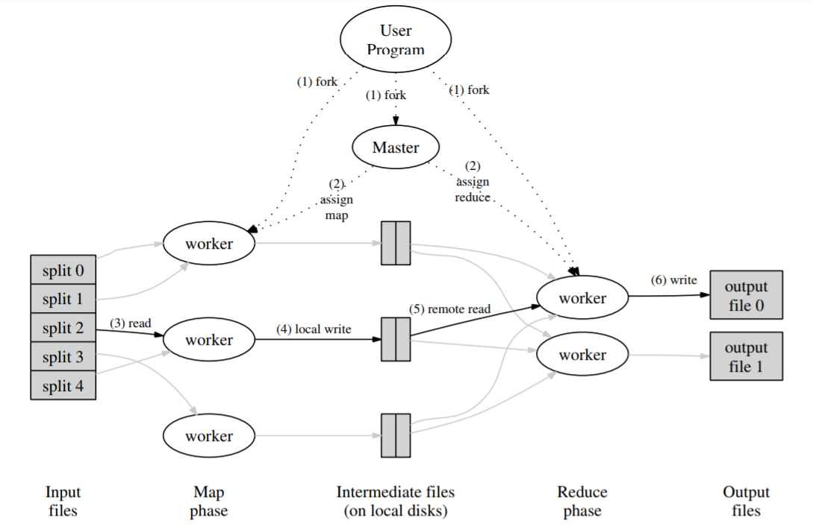
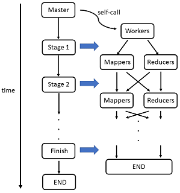
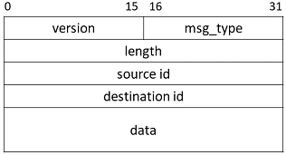
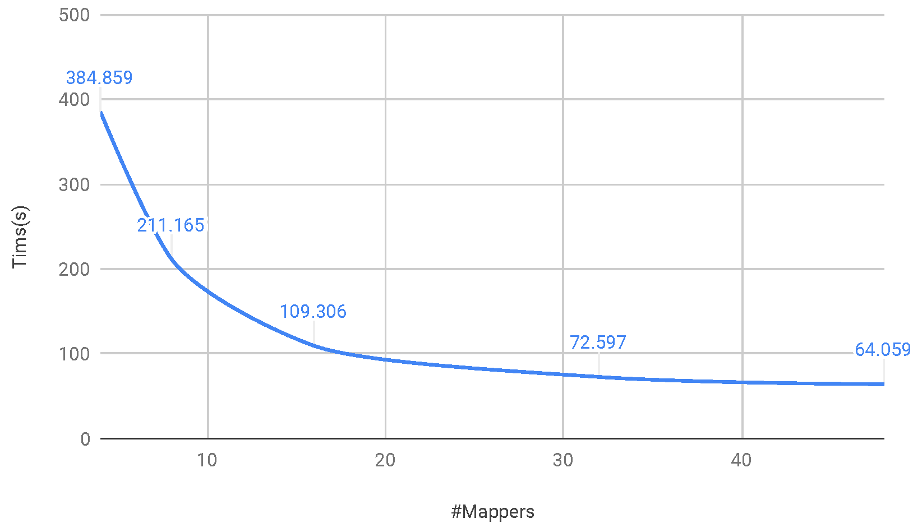
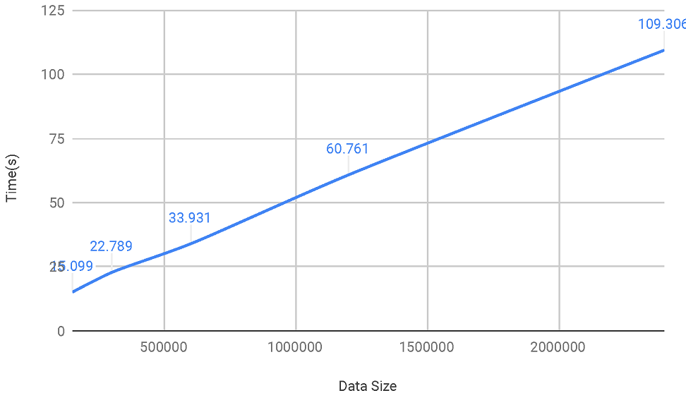
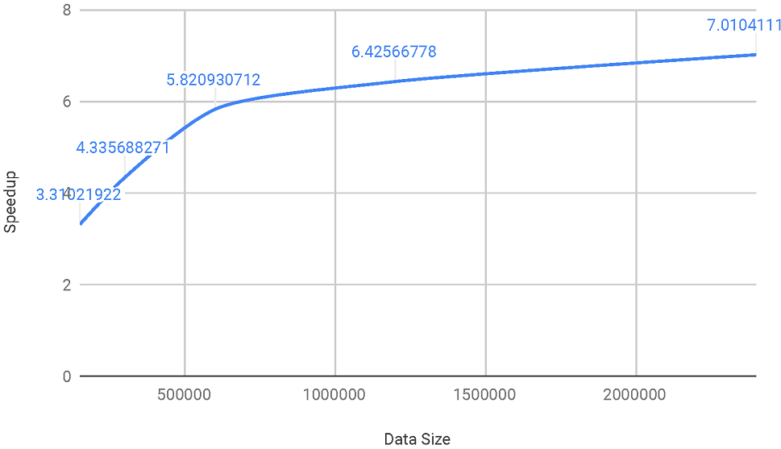
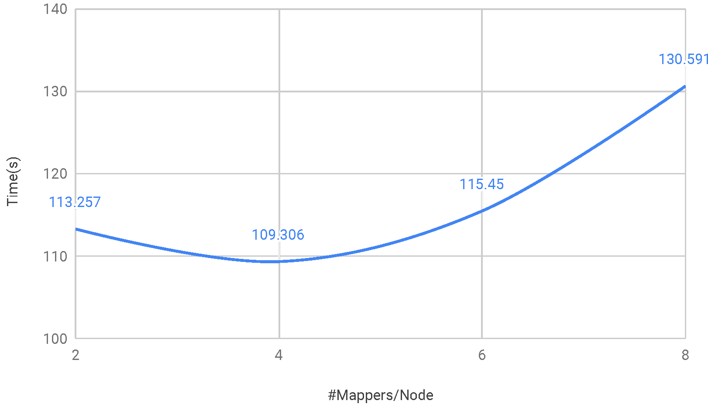

last update: 12/16/2018
* Project repository: [here](https://github.com/hzh0512/Lightweight-MapReduce)
* Project proposal: [here](../assets/files/lmr_proposal.pdf)
* Project checkpoint: [here](../assets/files/lmr_checkpoint.pdf)
* Project final report: [here](../assets/files/lmr_final_report.pdf)
* Project poster: [here](../assets/files/lmr_poster.pdf)

# Summary

We implemented a lightweight MapReduce framework using C++, and demonstrated several machine learning algorithms (e.g. naïve bayes, logistic regression etc.) on top of it, which shows the feasibility of large scale parallel machine learning algorithms.

# Background


<center>Fig 1: Execution overview. Image credit: Dean, Ghemawat</center>

As big companies are collecting more and more data (e.g. logging info, clicking data, social network info etc.) from users, they are facing a tough problem of dealing with a large amount of data. The processing and analyzing tasks require huge computation power from hundreds or even thousands of computers. Many of the problems are pretty straightforward such as word counting, naïve bayes classification etc., and the intrinsic difficulty instead becomes how to distribute and parallelize the workload efficiently. To focus on the business logic itself instead of the general parallelism problem, Jeffreay Dean etc. proposed a programming model named MapReduce, where users specify a *map* function to generate a set of intermediate key/value pairs, and a *reduce* function to merge all intermediate values with the same key (see diagram above). It turns out that many real world problems can be expressed in this model. And this idea enables great convenience for programmers without any experience with parallel systems to write highly scalable programs.

Our 15618 project is to implement such a MapReduce framework that will take care of the details of partitioning the input data, scheduling and distributing tasks and so on. It is lightweight because it *does not* handle unexpected situations such as machine failures, network interruptions or hard drive problems etc, and it will take advantage of existing distributed file system for sharing partial results. The framework will support dynamic work distribution by assigning one master which saves the task states and controlling the rest workers.

# Approach


<center>Fig 2: Work flow of a task</center>

The main workflow is as above. The master is executed by the user and then it will ssh to other machines to bring up all the workers specified in a configuration file by the user. Note that the program is in a single binary file which has the ability to turn into a master as well as a worker. What it will be is determined by the argument passed to it at the beginning. The task may be splitted into multiple stages and requires several rounds of Maps and Reduces (e.g. KMeans has a threshold to stop the iteration, Naïve Bayes has two stages for training, etc.), and the scheduling is solely controlled by the master node. After each stages there is a barrier for all the workers and only then the master will trigger the next stage. 

After all the workers have checked in with the master at the beginning, stage 1 starts. At each stage the master would assign each worker to be a mapper or reducer. A mapper will be assigned an input file by the master and notify the master when it is done and get its next input. The output of mappers are called temporary files or partial results which will be used by reducers as input and be deleted after this stage. After all the mappers are done, reducers are assigned to work on the partial results and output the final result of this stage in the end. The stage finishes after all the reducers are done, and then the next stage starts until the end.

The worker is able to turn into a mapper or reducer dynamically, which is beneficial for the whole speedup. Because in some cases the mapper side has much more work to do and it would be helpful to assign more mappers than reducers. Note that a single machine can run multiple workers at the same time, so the MapReduce framework takes advantage of both multi-process parallelism and distributed system.


<center>Fig 3: TCP packet format</center>

We designed our own packet header as in Figure3. **msg_type** includes LMR_CHECKIN, LMR_ASSIGN_MAPPER, LMR_MAPPER_DONE etc. for assigning handlers more conveniently. For example, upon receiving LMR_CHECKIN the master will increase the counter and check whether all workers have checked in. Upon receiving LMR_ASSIGN_MAPPER the mapper will start working on the input specified in the **data** field.

In the message handler, it will spawn a new thread to do the work as it may take a long time and block later messages. When encountering unexpected worker failure, the TCP connection with the master is down which will cause the master to shut down the whole task.

# Sample Code for K-Means
```C++
#include "../src/mapreduce.h"
#include "../src/ml/kmeans.h"
 
using namespace lmr;
using namespace std;
 
int main(int argc, char **argv)
{
    MapReduceSpecification spec;
    MapReduceResult result;
 
    spec.config_file = "config.txt";
    spec.index = (argc == 2) ? atoi(argv[1]) : 0;
    spec.num_mappers = 10;
    spec.num_reducers = 10;
    
    MapReduce mr(&spec);
    ml::kmeans km(&mr);
 
    // 10 inputs, threshold is 0.1, maximum 20 iterations
    km.train("input_%d.txt", 10, "centroids.txt", 0.1, 20, result);
    km.predict("input_%d.txt", 10, "result_%d.txt", result);
 
    // print prediction time cost.
    printf("%.3fs elapsed.\n", result.timeelapsed);

    return 0;
}
```

# Results
The following results are tested on the GHC machine cluster each with an eight core Xeon E5-1660 CPU with 2-way hyperthreading.

## Different number of mappers

<center>Fig 4: Time vs. Number of mappers</center>

## Different number of inputs

<center>Fig 5: Time vs. Number of inputs</center>

## Speedup vs. Inputs (optimally 8x speedup)

<center>Fig 6: Speedup vs. Number of inputs</center>

## Time vs. Number of mappers per node
Eight core each node with 2-way hyperthreading

<center>Fig 7: Time vs. Number of mappers per node</center>

# Conclusion

Features:
* Scalability: The applications can be easily implemented on multi-node system, and the scalability of the application is ideal when the problem size is large enough.
* Dynamic Scheduling: The framework support dynamic scheduling for mappers and reducers. When the input files are not partitioned evenly, this feature can improve the work-load balance of the system.
* Connection Reuse: After the connections between master and workers are set, different rounds of MapReduce will reuse these connections to avoid starting overhead.

Issues:
* Starting Overhead: For application with few iterations, the overhead of workers assignment would overweigh the benefit of more workers.
* Critical Section: When mappers or reducers send finishing message to master, there is a critical section in master to protect the job queue and finishing counter, which must be done sequentially and may limit the scalability.

# Resources

* Personal laptops can be used for developing. Moreover, GHC26-46 machines could be used for testing for scalability.
* The [paper](https://research.google.com/archive/mapreduce-osdi04.pdf) from Google is our reference.
> J. Dean and S. Ghemawat, MapReduce: Simplified Data Processing on Large Clusters. Communications of the ACM, 2008
* A word counting implementation on a single machine on [Github](https://github.com/cdmh/mapreduce). Another implementation with static scheduling pattern on [Github](https://github.com/wangkuiyi/mapreduce-lite).
* Several ML algorithms implementated in MapReduce are mentioned in this [paper](https://papers.nips.cc/paper/3150-map-reduce-for-machine-learning-on-multicore.pdf). 
> C. Chu etc., Map-Reduce for Machine Learning on Multicore. Proceedings of the 19th International Conference on Neural Information Processing Systems, 2006
* Furthermore, some implementation in Python can be found [here](https://github.com/AmazaspShumik/MapReduce-Machine-Learning). Another implementation in Hadoop is [here](https://github.com/punit-naik/MLHadoop).

# Goals and Deliverables

* [75%] Implement the framework with static workload assignment and demonstrate with word counting.

* [100%] Implement dynamic assignment and demonstrate with word counting.

* [125%] Implement parallel machine learning algorithms as built-in functions.

* During the poster session, we can show the speedup graph of some algorithms comparing our performance with single-threaded version and see how it gets scalable with more machines. What's more, we can show the programming codes with our framework, which should be concise and easy to read.

* As a system project, we'd like the framework user should not care much about how the parallelism work in details and focus more on making business or analyzing work. The performance should scale with more computers.

# Platform Choice

We decide to use C++ and focus on Linux. Because C++ is highly efficient compared with Java, the STL and thread/chrono standard libraries give us enough flexibility, and libevent library makes it more portable and convenient for asynchronous network communication and serialization. Linux is the mainstream operating system in servers and supercomputers.


# Schedule

* Week 1 (Until 11/4): Read the Google paper and be familiar with existing code on Github.

* Week 2 (Until 11/11): Implement low-level TCP/IP asynchronous communication protocol.

* Week 3 (Until 11/18) (11/19 Checkpoint): Finish basic functionality of the MapReduce framework with static work assignment and demonstrate with word counting example program.

* Week 4 (Until 11/25): (1) Zihao: further test the static version. (2) Shiming: test on more optimized work distribution designs.

* Week 5 (Until 12/2): (1) Both: optimize the framework and read papers about machine learning implementations on MapReduce framework. (2) Both: implement some mahine learning algorithms.

* Week 6 (Until 12/9): Both: test on the performance of ML algorithms.

* Week 7 (Until 12/16) (12/15 Final Report): Both: write the final report.