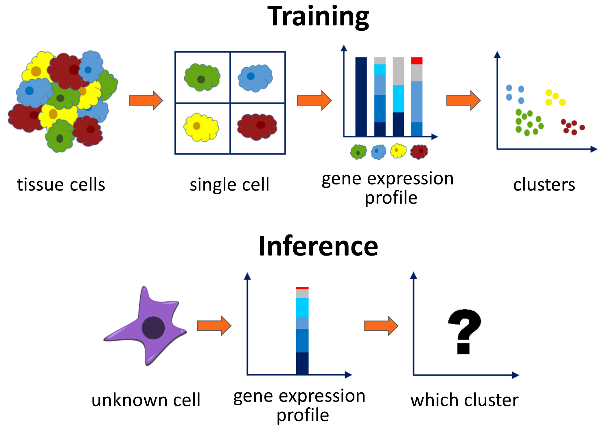
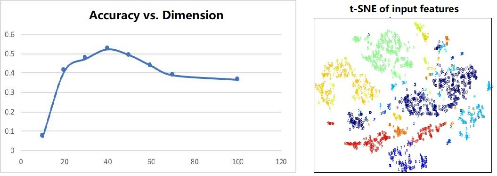
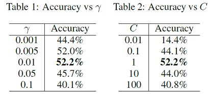
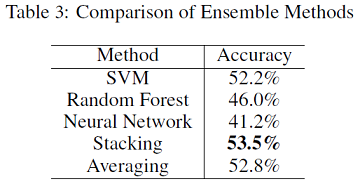

last update: 12/16/2018
* Project repository: [here](https://github.com/hzh0512/10701-singlecell)
* Project proposal: [here](../assets/files/10701_proposal.pdf)
* Project final report: [here](../assets/files/10701_final_report.pdf)
* Project poster: [here](../assets/files/10701_poster.pdf)
* Project introduction: [here](http://www.cs.cmu.edu/~pradeepr/701/Project/ProjectsSingleCellAnalysis.html)

# Abstract

Different cells in human body express different subsets of genes at different levels, which empowers people to determine the type of a cell solely based on its gene expression profile using single-cell RNA sequencing (*scRNA-seq*). This report shows an algorithm combining PCA and SVM to predict cell type out of its gene expression profile with an accuracy of 52.2%. Experiments indicate that the algorithm possesses the strong ability of generalization and the training and inference process is fast and efficient. Using model stacking approach to combine SVM with random forest and neural network, we can further achieve **53.5%** accuracy.

# Background

Fig 1: General view of training and inference process

Genes contain information of instructing how to build a molecule, and different cells in our body express different subsets of these genes at different levels. A technique named single-cell RNA sequencing (scRNA-seq) can be used to measure the activity levels of some annotated genes in a single cell, the result of which is termed the gene expression profile. The same type of cells (e.g. lung cell, brain cell, skin epidermis) are closely related to its gene expression profile and tend to have a similar distribution. Thus, this property makes it possible to predict the type of a cell solely from its gene expression profile. Accurate prediction is important in many cases. For example, the ability to tell the composition of a cancer biopsy sample has a huge impact on the type of treatment prescribed, and it's also helpful for identifying and characterizing new cell types and cell states[1, 2].

Given the training pairs of a gene expression profile and its ground truth cell type, the goal of the project is to classify the type of an unknown cell based on its gene expression profile. Since the test set contains different experiments from the training set, the distribution may not be exactly the same. The classifier model itself must possess balanced abilities of learning and generalization.

# Approach

## Preprocessing

Fig 2: On the left is the accuracy plot after SVM vs. dimension of the PCA output. On the right is a 2D t-SNE representing the plot of the first 10 classes after PCA.

Due to the high dimension (p=20499) of the original input, the training overhead is too large and is prone to be affected by unrelated noises. Hence, we first apply a dimensional reduction algorithm on the datasets to extract key information out of the input. We also do normalization on the low-dimension data before fitting into any model to remove the scale effect.

We choose Principal Component Analysis (PCA) as our final choice of dimensional reduction and record the first $40$ principal components of the training set. Then the mean and standard deviation of the PCA output are stored. For training and testing, we project the data onto those 40 principle components and apply normalization according to the saved values. 

We also tried other reduced dimensions. However, in experiments, we found that when the dimension is small, we can lose some important information, and when the dimension is large, some unrelated information encoded by minor principal components can mislead the classification. By tuning carefully, we choose 40 as our final choice. The trend is shown on the left in figure 2. On the right shows the visualization of the output. Different colors represent different classes and it shows that PCA maintains the spatial locality within each cluster, thus linear projection is enough for further classification. We have also tried non-linear dimensional reduction methods like Locally Linear Embedding (LLE) and auto-encoder but failed to observe a significant improvement.

## SVM

The input dimension is now 40 and 20k data samples are still relatively sparse in the space. SVM is suitable for this kind of problems as it assumes that there exists a hyperplane separating the input data into different classes, which is easy to be done in high-dimensional space. Here we employ one-vs.-rest scheme and RBF kernel for multi-classification. The final label is the one with the largest margin to the decision boundary, which means the data point is more likely to be on this side. Note that although it is not typically what we train the SVM for, it often works well in practice. And in this case, it's especially important to normalize the input first because SVM is sensitive to the input scale to compare the margin distance.

## Ensemble Stacking

We have trained a small neural network for model stacking. The input is the concatenated probability vectors generated by the decision tree, neural network and support vector machine models. There is one hidden layer with exactly the same number of neurons as the input. The output is a 46-dimension vector which produces the final probability using softmax. The network is trained on training data. However, when we evaluate the model on testing data, we found that the performance does not become better than using the single SVM model.

After investigating the results, we notice that the training strategies of SVM are different when with probability and without probability, which means the label with the highest probability may not always equal to the predicted label without using probability. In this specific problem, SVM model without using probability gives a 3% higher accuracy than the model using probability, and our stacking approach is using the SVM with probabilities. Therefore we also add a one-hot encoder with the SVM predicted label at the end of the input vector. The new stacking approach gives 1.3% increase in accuracy compared with a single SVM model.

# Results

Table 1 and table 2 show the accuracy under different hyperparameters γ for the RBF kernel radius and C for the penalty weight. C is fixed at 1.0 with regard to Table 1 and γ is set to 0.01 in Table 2. We finally choose γ=0.01 and C=1 and achieved 52.2% accuracy on test set. The experiments are implemented using scikit-learn[3] in Python. The training and testing process takes around 30 seconds and 3 seconds.

From table 3, we can see that using a shallow neural network for probability stacking can produce better ensemble results compared with averaging probabilities of three models. The ensemble model achieves slightly better accuracy than the single SVM model.

# Conclusion

The best single classification model is built based on SVM and achieves 52.2% accuracy. First, PCA is used to extract the most important information and to accelerate training, and the lower dimensional data is normalized using Z-scores. The RBF kernel SVM with the one-vs-rest scheme is imposed for multi-class classification in this model.

Besides SVM, we also tried random forest and neural networks. The random forest approach shows good generalization ability with the help of dimensional reduction and overfitting prevention techniques. The Neural Network method reaches its best performance when we have about 3 hidden layers with 10k randomly picked samples. The data is insufficient so this may partially account for why NN does not work as well as SVM or random forest in our experiments. 

At the same time, we also designed a combined model which achieves an accuracy of 53.5%. The model stacking approach makes use of all three models and produces a slightly better model than each of the individual one as expected.

# References
<small>
[1] Darmanis,S., Sloan,S.A., Zhang,Y., Enge,M., Caneda,C., Shuer,L.M., Gephart,M.G.H., Barres,B.A. and Quake,S.R. (2015) A survey of human brain transcriptome diversity at the single cell level. Proc. Natl. Acad. Sci. U.S.A., 112, 7285–7290.
</small> 
<small>
[2] Poulin,J.-F., Tasic,B., Hjerling-Leffler,J., Trimarchi,J.M. and Awatramani,R. (2016) Disentangling neural cell diversity using single-cell transcriptomics. Nat. Neurosci., 19, 1131–1141.
</small> 
<small>
[3] Pedregosa,F., Varoquaux,G., Gramfort,A., Michel,V., Thirion,B., Grisel,O.,  Blondel,M., Prettenhofer,P., Weiss,R., Dubourg,V., Vanderplas,J., Passos,A., Cournapeau,D., Brucher,M., Perrot,M., Duchesnay,E.. Scikit-learn: Machine Learning in {P}ython. Journal of Machine Learning Research, Volume 12, Page 2825-2830, 2011.
</small>